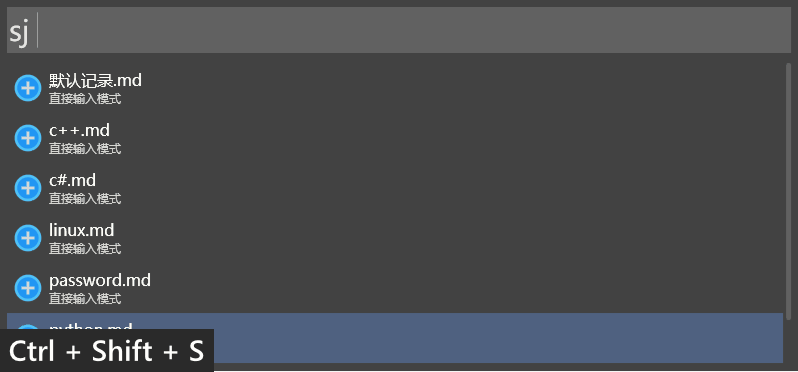
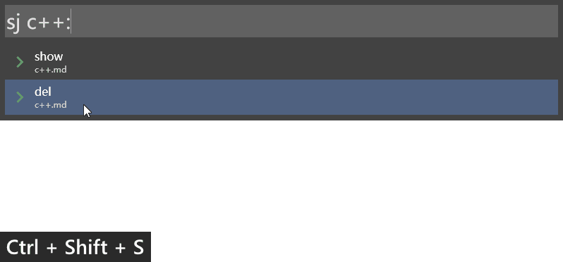
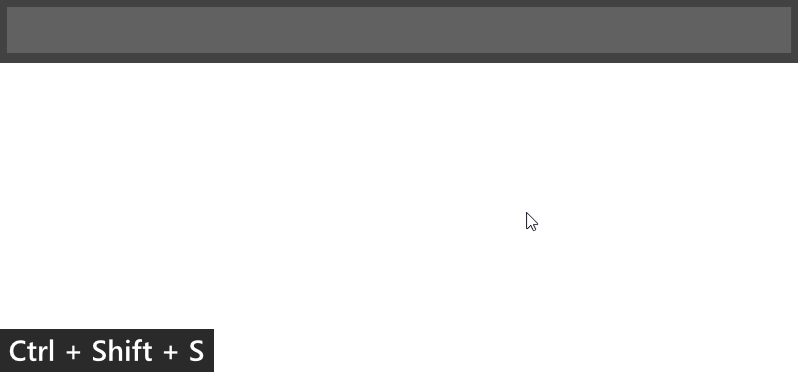
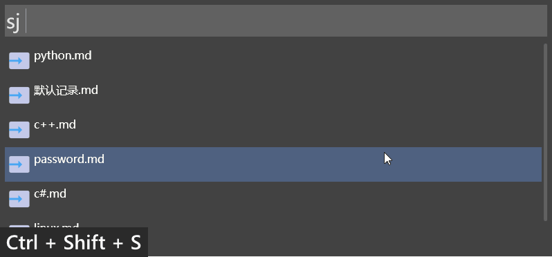
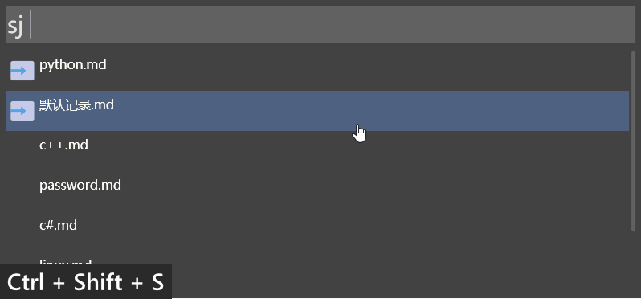

## 随手记  

### 插件设置
```json
{
    "doc_root": "C:\\Users\\13972\\Documents\\随手记"
}
```
`doc_root`: 文档根目录

### 模式

#### 直接输入模式
输入插件关键字（`sj`）后，可以直接输入笔记内容，再选择相应的文档，即可将笔记添加到文档中。  


#### 模糊匹配模式
输入插件关键字（`sj`）后，输入文档的部份名称，再加上`:`则进入模糊匹配模式。  
在模糊匹配中，如果未匹配到文档，则可以选择默认文档。  
如果有多个匹配，选中文档选项，即可进入文档的完全匹配模式。  


#### 完全匹配模式
如果输入的文档名称与某文档完全相同，则进入完全匹配模式。此时选项中会包含可对此文档执行的命令。  
如果文档名称是其它文档名称的一部分，也可以选择其它的文档。


#### 多行输入模式
输入插件关键字（`sj`）后，输入文档的部份名称，再加上`::`则进入文档的多行输入模式。
在多行输入模式中，输入一条笔记，并不会隐藏主界面，而是可以继续输和下一条笔记。
  

### 功能点

#### 添加笔记  
输入插件关键字（`sj`）后，可以直接输入笔记内容，再选择相应的文档，即可将笔记添加到文档中。也可以通过匹配模式，先查找文档，再输入笔记内容，存入对匹配的文档中。

#### 文档选译  
支持多个文档，并通过文档名称模糊匹配，减小文档的查找范围。选择相应的文档即可对文档执行具体的操作。  
程序内置默认文档，在未匹配到文档等时候，可以将笔记添加到默认文档中，也可以新建文档，将笔记添加进去。

#### 文档指令  
选择相应的文档，输入指令后，即可对指令执行相应的操作。
目前的指令有：  
+ `show`：显示文档中的所有笔记  
  
+ `del`：删除文档，将文档移置回收站中  

